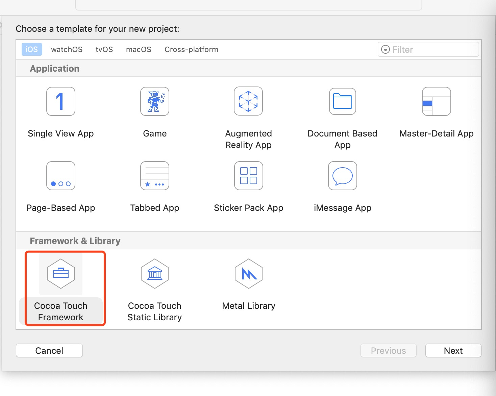
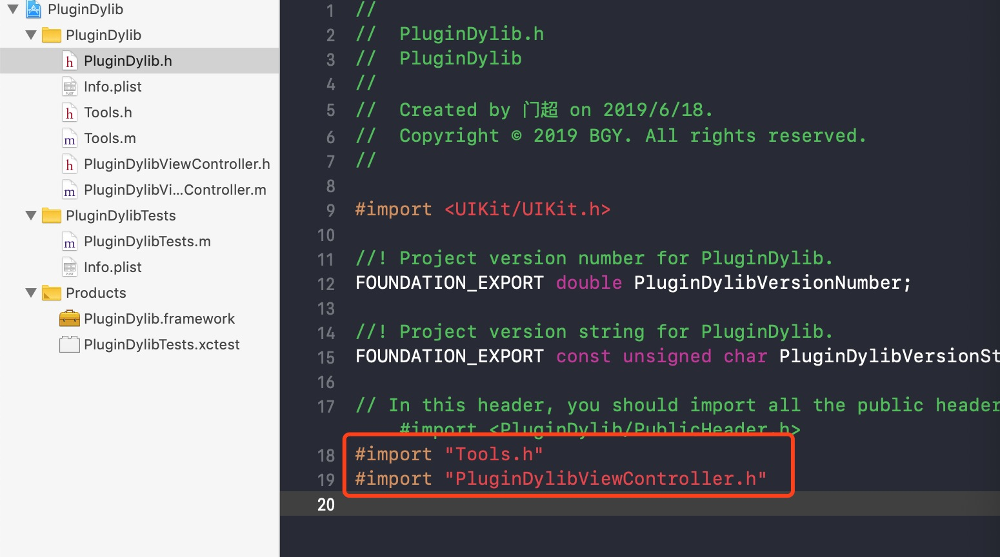
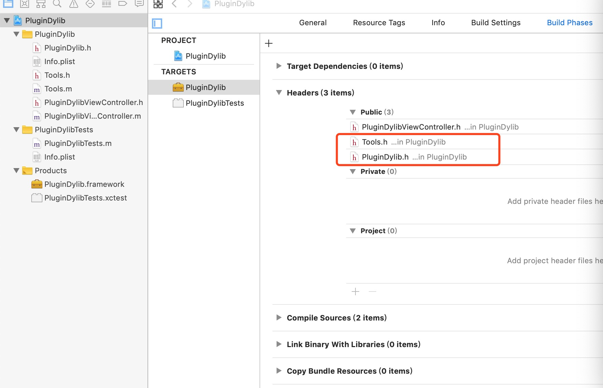
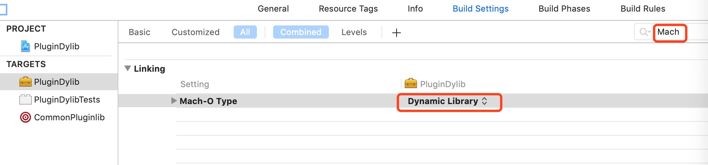
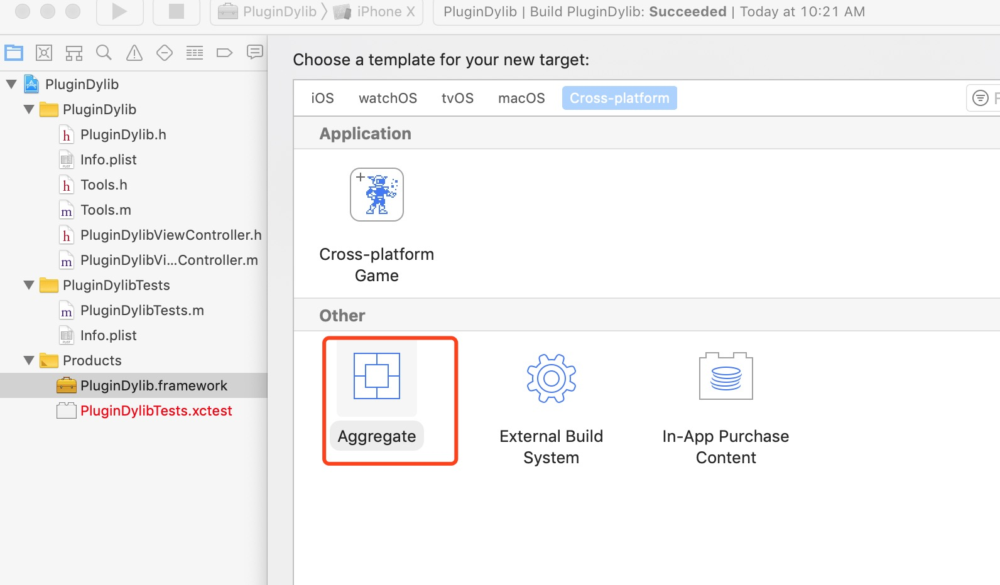
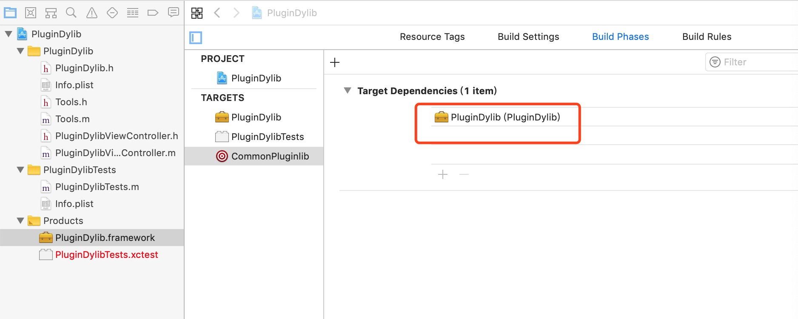
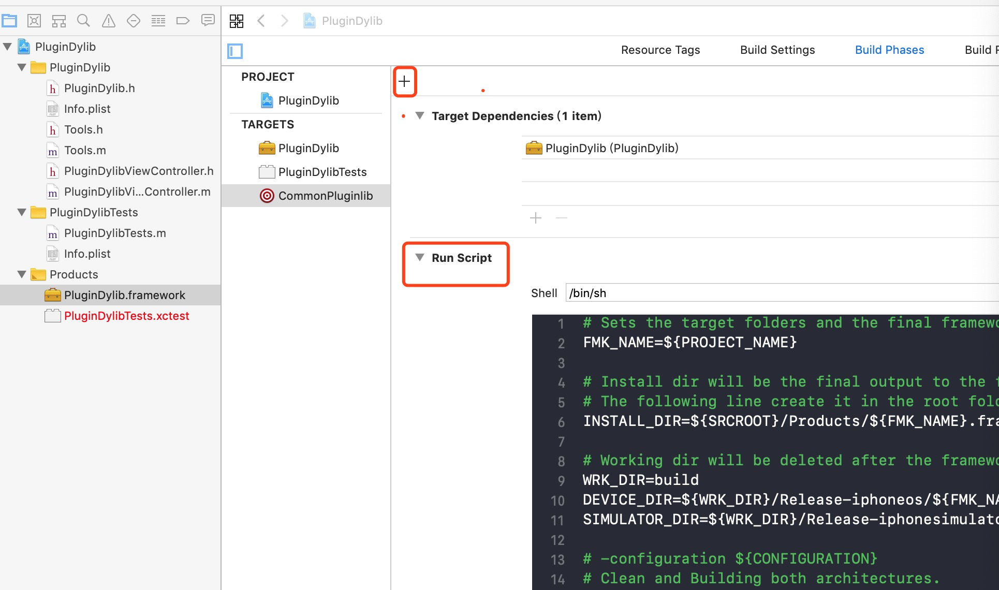

   苹果应用包很大，好几百M;软件功能越来越很多，但有些甚至从来不用,能否按需使用;新增功能能否不用更新app，也能使用新功能；某个功能出问题了，能否不用更新app，直接修复等等，这些功能可以使用web页面的方式，但用户体验，某些特殊功能如使用蓝牙等等其他就无法用web实现，这里只讲原生实现，如果使用原生，这些功能 能否动态加载，需要的时候从服务端下载到本地,然后加载显示呢？。这将引入今天的主题，插件化开发。
    静态库，动态库
    静态库: 连接时完整拷贝至可执行文件中，被多次使用就有多份冗余拷贝
    动态库: 链接时不复制，程序运行时有系统动态加载，供程序调用，系统只加载一次，
    
 下面从一个具体例子讲解如何在iOS上进行插件化开发
 
### 一.生成动态库
   
 1.xcode工程中新建framework项目，工程名为PluginDylib。
 
 
 2.创建2个类，Tools 和 PluginDylibViewController
 
 ```
 /**
 工具类
 */
@interface Tools : NSObject

+ (NSString *)dateString;
+ (void)showLog;

@end

@implementation Tools

+ (NSString *)dateString{
    NSDate *date = [[NSDate alloc]init];
    return  [date description];
}

+ (void)showLog{
    NSLog(@"showLog...");
}

@end
 
 ```
 
 ```
 @implementation PluginDylibViewController

- (void)viewDidLoad {
    [super viewDidLoad];
    self.view.backgroundColor = [UIColor redColor];
}


@end

 ```
 3.在PluginDylib.h中引入需要外部调用的头文件，#import "Tools.h" ， #import "PluginDylibViewController.h" 

 
 
 4.设置开放头文件
 
 需要暴露的头文件，可以通过Target—>Build Phases—>Headers来设置，这样在生成的framework的 Header目录下就可以看到这两个头文件了.
 
 
 5.设置动态库
 
 
 6.合并动态库
 上一步的操作并不同时支持真机和模拟器，需要进行合并,创建Aggregate Target，命名为CommonPluginlib，具体如下，
 
 
 
 设置Target Dependencies，将PluginDylib.framework加入依赖，
 
 
 
 添加Run Script,如下图所示
 
 
 脚本主要是合并真机和模拟器的的framework；
 
  ```
 有两种方式，一使用命令行lipo -create ：如 lipo -create XXX/PluginDylib_iphone.framework/  PluginDylib  XXX/PluginDylib_simulator.framework/PluginDylib   
 -output  XXX/PluginDylib_iphone.framework/PluginDylib,合并真机和模拟器到真机库里
  ```
  
 另外一种方法使用脚本合并，直接添加在xcode中，更方便一些
 
 ```
# 运行此脚本前
# 先编译一遍工程  确保正常运行 没有报错
# 作为Xcode Aggregate运行
# file-->new target-->cross-platform-->Aggregate

#!/bin/sh
UNIVERSAL_OUTPUTFOLDER=${BUILD_DIR}/${CONFIGURATION}-universal
WORKSPACE_NAME=${PROJECT_NAME}.xcodeproj

# make sure the output directory exists
mkdir -p "${UNIVERSAL_OUTPUTFOLDER}"

# Step 1. Build Device and Simulator versions
echo 'Step 1. Build Device and Simulator versions'

xcodebuild -project "${WORKSPACE_NAME}" -target "${PROJECT_NAME}" -configuration ${CONFIGURATION} -sdk iphoneos ONLY_ACTIVE_ARCH=NO   BUILD_DIR="${BUILD_DIR}" BUILD_ROOT="${BUILD_ROOT}" clean build

xcodebuild -project "${WORKSPACE_NAME}" -target "${PROJECT_NAME}" -configuration ${CONFIGURATION} -sdk iphonesimulator ONLY_ACTIVE_ARCH=NO BUILD_DIR="${BUILD_DIR}" BUILD_ROOT="${BUILD_ROOT}" clean build

# Step 2. Copy the framework structure (from iphoneos build) to the universal folder
cp -R "${BUILD_DIR}/${CONFIGURATION}-iphoneos/${PROJECT_NAME}.framework" "${UNIVERSAL_OUTPUTFOLDER}/"

# Step 3. Copy Swift modules from iphonesimulator build (if it exists) to the copied framework directory

SIMULATOR_SWIFT_MODULES_DIR="${BUILD_DIR}/${CONFIGURATION}-iphonesimulator/${PROJECT_NAME}.framework/Modules/${PROJECT_NAME}.swiftmodule/."

if [ -d "${SIMULATOR_SWIFT_MODULES_DIR}" ]; then

cp -R "${SIMULATOR_SWIFT_MODULES_DIR}" "${UNIVERSAL_OUTPUTFOLDER}/${PROJECT_NAME}.framework/Modules/${PROJECT_NAME}.swiftmodule"
fi


# Step 4. Create universal binary file using lipo and place the combined executable in the copied framework directory

lipo -create -output "${UNIVERSAL_OUTPUTFOLDER}/${PROJECT_NAME}.framework/${PROJECT_NAME}" "${BUILD_DIR}/${CONFIGURATION}-iphonesimulator/${PROJECT_NAME}.framework/${PROJECT_NAME}" "${BUILD_DIR}/${CONFIGURATION}-iphoneos/${PROJECT_NAME}.framework/${PROJECT_NAME}"

# Step 5. Convenience step to copy the framework to the project's directory
cp -R "${UNIVERSAL_OUTPUTFOLDER}/${PROJECT_NAME}.framework" "${PROJECT_DIR}"

# Step 6. Convenience step to open the project's directory in Finder
open "${PROJECT_DIR}"

 ```
 动态库签名
 
动态库生成后，就可以开始使用了。
### 二.动态库的使用

